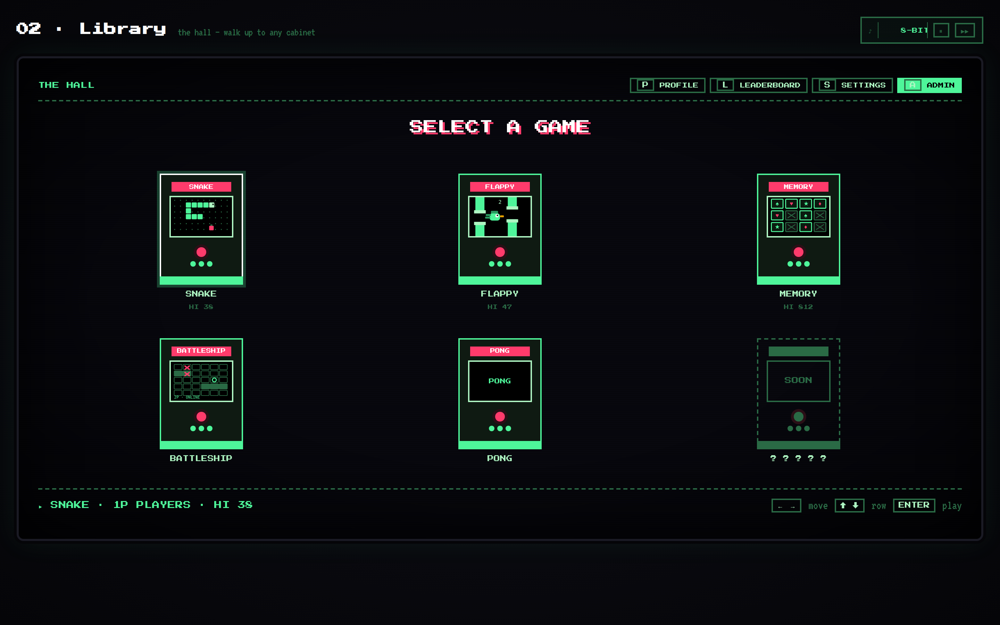
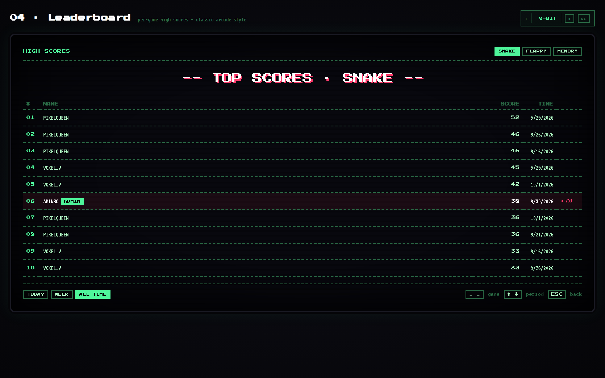
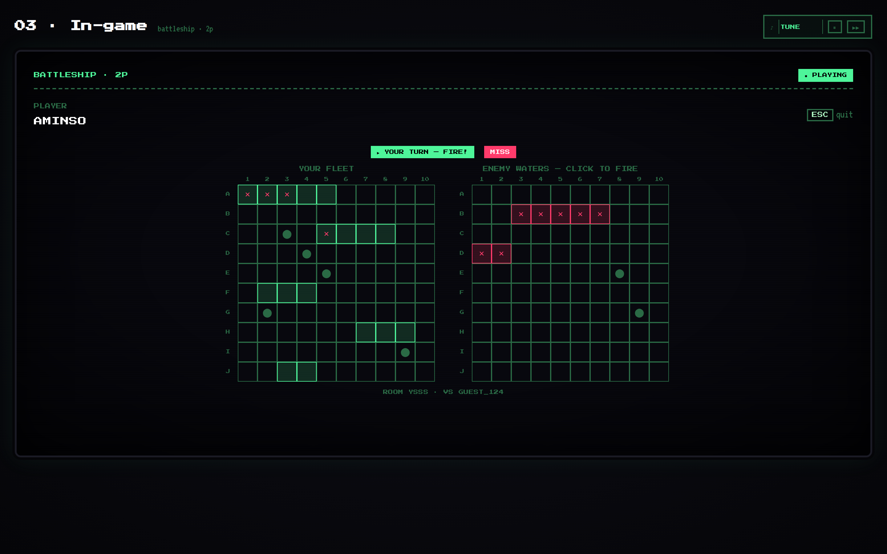

# ARCO — Retro Arcade

A retro CRT-styled arcade web app with 4 games, real-time online multiplayer, AWS-backed auth, leaderboards, and user profiles.



| Leaderboard | Online Battleship |
|---|---|
|  |  |

---

## Games

| Game | Mode |
|---|---|
| Snake | 1 Player |
| Flappy Bird | 1 Player |
| Memory | 1 Player |
| Battleship | Online Multiplayer (socket.io) |

---

## Tech Stack

| Layer | Tech |
|---|---|
| Frontend | React + Vite, custom CSS (CRT/arcade aesthetic) |
| Backend | Node.js + Express + socket.io on AWS EC2 (t3.micro, eu-west-1) |
| Auth | AWS Cognito — email + username, JWT verification |
| Database | AWS DynamoDB — `arco-users` + `arco-scores` (on-demand) |
| Hosting | S3 (frontend build) + CloudFront (CDN + API routing) |
| Process manager | PM2 on EC2 |
| IaC | Terraform — full infrastructure as code |

---

## Project Structure

```
arco/
├── src/
│   ├── api/client.js           # All API calls to backend
│   ├── config/admins.js        # Admin user IDs (frontend gate)
│   ├── context/AppContext.jsx  # Global state + auth logic
│   ├── screens/                # Landing, Library, InGame, Leaderboard, Profile, Admin, Settings
│   └── games/                  # snake, flappy, memory, battleship
├── server/
│   ├── index.js                # Express entry + socket.io attach
│   ├── socket.js               # Battleship WebSocket event handlers
│   ├── game.js                 # Pure Battleship logic
│   ├── rooms.js                # In-memory room store
│   ├── middleware/auth.js      # Cognito JWT verification
│   ├── routes/                 # auth, scores, users, admin, stats
│   └── db/dynamo.js            # DynamoDB DocumentClient
├── terraform/                  # Full AWS infrastructure as code
│   ├── main.tf
│   ├── ec2.tf / s3.tf / cloudfront.tf / dynamodb.tf / cognito.tf / iam.tf
│   ├── deploy.tf               # Auto-builds + deploys frontend on apply
│   ├── userdata.sh             # EC2 bootstrap script
│   └── outputs.tf
└── .env.example
```

---

## Deploy Everything with Terraform (Recommended)

Spins up the full stack on a fresh AWS account with a single command.

### Prerequisites
- [Terraform](https://developer.hashicorp.com/terraform/install) installed
- [AWS CLI](https://docs.aws.amazon.com/cli/latest/userguide/getting-started-install.html) configured
- Node.js 20+ and npm installed (for the frontend build step)

### Steps

```bash
git clone https://github.com/amine-wehbe/ARCO.git
cd ARCO

aws configure   # enter your AWS credentials + region: eu-west-1

cd terraform
terraform init
terraform apply # type "yes" — takes ~15–20 min (CloudFront deployment)
# SSH is closed by default. To open it to your IP only:
# terraform apply -var "ssh_cidr=$(curl -s ifconfig.me)/32"
```

After apply, the terminal prints:

```
app_url                  = "https://xxxxxxxxxxxx.cloudfront.net"
ssh_command              = "ssh -i terraform/arco-key.pem ec2-user@x.x.x.x"
cognito_user_pool_id     = "eu-west-1_xxxxxxx"
cognito_client_id        = "xxxxxxxxxxxxxxxx"
```

> **Note:** Wait ~3 minutes after `terraform apply` finishes before testing. The EC2 user_data script (Node install + git clone + PM2 start) runs in the background after the instance is reported as running.

### Tear down

```bash
terraform destroy   # deletes all AWS resources created above
```

---

## Local Development

### Frontend

```bash
cp .env.example .env
# Set VITE_API_BASE_URL=http://localhost:3000
npm install
npm run dev
# → http://localhost:5173
```

### Backend

```bash
cd server
npm install
```

Create `server/.env`:

```
PORT=3000
AWS_REGION=eu-west-1
COGNITO_USER_POOL_ID=<your-user-pool-id>
COGNITO_CLIENT_ID=<your-app-client-id>
ALLOWED_ORIGIN=http://localhost:5173
```

```bash
node index.js
# → http://localhost:3000
```

---

## Manual AWS Setup (without Terraform)

### 1. Cognito User Pool
- Sign-in: **Email**
- Required attributes: `email`, `preferred_username`
- App client: **SPA**, auth flow: `ALLOW_USER_PASSWORD_AUTH`

### 2. DynamoDB Tables

**arco-users** — `userId` (PK, String), billing: On-demand

**arco-scores** — `gameId` (PK, String), `sk` (SK, String), billing: On-demand
- GSI: `gameId-score-index` — PK: `gameId`, SK: `score` (Number)

### 3. IAM Role
Create `arco-ec2-role` with an inline policy allowing only `dynamodb:GetItem`, `PutItem`, `UpdateItem`, `Query` and `Scan` on the `arco-users` and `arco-scores` tables (and `arco-scores/index/*`). Attach to EC2. No Cognito permissions are needed — the auth calls are public app-client APIs.

### 4. EC2 (Amazon Linux 2023, t3.micro)

Security group: port 3000 from the CloudFront origin-facing prefix list only (`com.amazonaws.global.cloudfront.origin-facing`), port 22 from your IP only.

```bash
dnf install -y git nodejs20 nodejs20-npm
npm install -g pm2
git clone https://github.com/amine-wehbe/ARCO.git
cd ARCO/server
npm install
# create .env with Cognito values
pm2 start index.js --name arco-server
pm2 save && pm2 startup
```

### 5. CloudFront Behaviors (in order)

| Path | Origin |
|---|---|
| `/socket.io*` | EC2 port 3000 — allow-all protocol (WebSocket) |
| `/auth*` | EC2 port 3000 |
| `/scores*` | EC2 port 3000 |
| `/users*` | EC2 port 3000 |
| `/admin*` | EC2 port 3000 |
| `/stats*` | EC2 port 3000 |
| `/health` | EC2 port 3000 |
| `/*` (default) | S3 website endpoint |

> CloudFront rejects raw IPs as origin — use `<EC2-ELASTIC-IP>.nip.io` as the EC2 origin domain.

---

## API Reference

Base URL: CloudFront domain (or `http://localhost:3000` locally).

### Auth
```
POST /auth/signup    { email, password, username }
POST /auth/confirm   { email, code }
POST /auth/login     { email, password }  → { token, userId }
POST /auth/logout    Bearer
```

### Scores
```
POST /scores         Bearer  { gameId, score }
GET  /scores/:gameId         → { leaderboard: [...] }
```
Valid `gameId` values: `snake`, `flappy`, `memory`, `battleship`

### Users
```
POST  /users         Bearer  { username }
GET   /users/:id     Bearer  → { userId, username, avatar, gamesPlayed, best_* }
PATCH /users/:id     Bearer  { username?, avatar? }
```

### Admin
```
GET /admin/stats     Bearer + admin ID → { totalUsers, games: [...] }
```

### Public
```
GET /stats           → { totalUsers, globalHi }
GET /health          → { status: "ok" }
```

---

## Battleship Multiplayer

Powered by socket.io on the same EC2 port (3000), routed through CloudFront via the `/socket.io*` behavior.

Players are identified once, at connection time: signed-in users by their verified Cognito ID token, guests by a random per-tab ID. Room events never trust a user ID sent by the client, so nobody can take over another player's seat or read their board.

- Create a room → get a 4-character code
- Share code with opponent → they join
- Place ships → both confirm → game starts
- 60-second reconnect grace period on browser refresh

---

## Restarting EC2 After Stop

```bash
# SSH in (get the exact command with: terraform output ssh_command)
ssh -i terraform/arco-key.pem ec2-user@<ELASTIC-IP>

# Check server status
pm2 status

# Restart if needed
pm2 restart arco-server

# Verify
curl http://localhost:3000/health
```

The Elastic IP stays the same across stop/start — CloudFront needs no update.

---

## Team
AUB CS Final Year Project — 2025/2026
